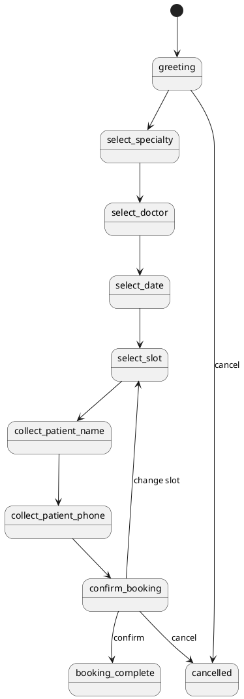

# SPEC-1-Clinic-Booking-Agent

## Background

A clinic needs a conversational system that can automate appointment booking, reduce front-desk workload, and improve patient experience. The source article proposes a chatbot that guides a patient through specialty selection, doctor selection, time-slot selection, and booking confirmation using a stateful AI workflow. It separates the solution into four layers: persistence, business services, agent orchestration, and user interface.

For this design, we will treat the article as the MVP reference and turn it into an implementable production-oriented architecture. The initial MVP assumption is:

- Single clinic or single brand with one primary booking system
- Conversational appointment booking is the main workflow
- Human staff can still intervene outside the system when needed
- Doctor schedules are managed inside the system rather than synced from an external EHR/calendar in the first release
- Web chat is the primary channel in the MVP

The article’s prototype stack is LangGraph, OpenAI, SQLite, and Streamlit. For the architecture spec, we will preserve the workflow intent but evolve the design toward a contractor-ready implementation with clearer data models, operational boundaries, validation, and extensibility.

## Requirements

### Must Have

- Patients must be able to book an appointment through a conversational web chat interface.
- The system must support a single clinic in the MVP.
- The system must present available medical specialties supported by the clinic.
- The system must map a selected specialty to one or more doctors.
- The system must present bookable appointment slots based on doctor schedule and existing bookings.
- The system must collect minimum patient details required for booking: full name and phone number.
- The system must create and persist patient records and appointment records.
- The system must prevent double-booking of the same doctor, date, and time slot.
- The system must confirm booking details before final submission.
- The system must provide a booking reference that staff can use for support.
- The system must maintain conversational state across a session.
- The system must support safe handling of invalid input, off-topic messages, and cancellation.
- The system must provide a basic staff-operable method to seed and maintain doctors, specialties, and schedules.
- The system must log booking attempts, booking outcomes, and application errors for troubleshooting.

### Should Have

- The system should support appointment cancellation and rescheduling.
- The system should support multiple doctors per specialty.
- The system should support configurable slot lengths rather than assuming one-hour slots.
- The system should support clinic working days, holidays, and doctor-specific availability exceptions.
- The system should validate phone numbers and normalize them before storage.
- The system should deduplicate patients primarily by normalized phone number.
- The system should expose an admin or internal operations interface for managing schedules and appointments.
- The system should support human handoff when the bot cannot complete a request.
- The system should record structured analytics such as drop-off stage, booking completion rate, and slot utilization.
- The system should make LLM usage optional for purely deterministic steps where rules are sufficient.

### Could Have

- The system could send SMS or WhatsApp confirmations and reminders.
- The system could support multilingual conversations.
- The system could integrate with Google Calendar, Outlook, or a clinic PMS/EHR.
- The system could support insurance-related intake questions.
- The system could support FAQ-style customer service beyond booking.
- The system could support voice or telephony channels.
- The system could recommend the earliest available doctor within a specialty.

### Won't Have for MVP

- Multi-clinic tenancy.
- Deep EHR or billing integration in the first release.
- Online payments in the first release.
- Clinical triage, diagnosis, or medical advice generation.
- Free-form autonomous agent actions beyond defined booking and support workflows.
- Full omnichannel deployment across web, WhatsApp, SMS, and voice in v1.

## Method

The MVP will use a deterministic workflow implemented in TypeScript instead of an agent orchestration framework. This keeps the booking path auditable, easier to test, and safer for transactional operations such as slot reservation. The design will still isolate conversation orchestration behind interfaces so that LangGraph or another workflow engine can be introduced later without replacing the core business logic.

### Architecture Overview

The system is split into five layers:

1. **Web Chat Client**
   - Patient-facing browser UI
   - Renders chat history, quick replies, booking confirmation, and restart flow
   - Sends user messages to backend session endpoints

2. **Conversation API**
   - Node.js / TypeScript backend
   - Owns session state and workflow progression
   - Decides the next booking step based on current state and validated input
   - Calls LLM adapter only for intent extraction, slot/date normalization, and response phrasing

3. **Booking Domain Services**
   - Pure business logic modules
   - Manage specialties, doctors, schedules, patients, bookings, cancellation, and rescheduling
   - Enforce deterministic validation and transaction boundaries

4. **Persistence Layer**
   - SQLite database
   - Stores doctors, specialties, schedules, patients, conversation sessions, and bookings
   - Uses transactional writes to avoid double-booking

5. **LLM Adapter**
   - Optional AI helper for natural language understanding
   - Not a source of truth for booking logic
   - Can be disabled and replaced with rule-based parsing for constrained flows

### Core Design Principle

The LLM may help interpret what the user means, but it must never decide whether a booking is valid. Validity is determined only by the booking service and database state.

The AI integration must be provider-agnostic at the application boundary. In MVP, OpenRouter will be used as the model gateway so the team can switch models, providers, and fallback behavior without changing the conversation router or booking services.

### Future Compatibility with LangGraph

To enable future LangGraph adoption, the conversation layer will be built around explicit interfaces:

- `ConversationStateStore`
- `ConversationRouter`
- `ResponseGenerator`
- `AIProviderAdapter`
- `BookingApplicationService`

In MVP, these will be implemented directly in TypeScript. In a later version, `ConversationRouter` and parts of `ResponseGenerator` can be reimplemented with LangGraph while preserving the API layer, database schema, and booking services.

### Component Diagram

```plantuml
@startuml
actor Patient
rectangle "Web Chat UI" as UI
rectangle "Conversation API
(Node.js / TypeScript)" as API
rectangle "Conversation Router
Deterministic State Machine" as ROUTER
rectangle "LLM Adapter" as LLM
rectangle "Booking Services" as SERVICE
database "SQLite" as DB

Patient --> UI
UI --> API
API --> ROUTER
ROUTER --> LLM : optional intent/phrasing
ROUTER --> SERVICE
SERVICE --> DB
API --> UI
@enduml
```

### Proposed Runtime Flow

1. User sends a message from the web chat.
2. Backend loads or creates the conversation session.
3. Deterministic router checks the current stage.
4. Input is validated and optionally normalized through the LLM adapter.
5. Booking service fetches specialties, doctors, slots, or writes booking data.
6. Backend persists new state and returns assistant response plus structured options.
7. UI renders the next prompt and selectable actions.

### Workflow Stages

The conversation flow is explicitly modeled as a state machine:

- `greeting`
- `select_specialty`
- `select_doctor`
- `select_date`
- `select_slot`
- `collect_patient_name`
- `collect_patient_phone`
- `confirm_booking`
- `booking_complete`
- `cancelled`
- `handoff_pending`

Each stage accepts only a limited set of valid transitions. This is safer than allowing an autonomous agent to improvise the booking flow.

### Booking Workflow Diagram



### Technology Direction for MVP

- Frontend: Next.js web app
- Backend: Node.js with TypeScript
- Database: SQLite
- ORM/query layer: Drizzle ORM or Prisma
- AI integration: OpenRouter behind an AI provider adapter, so models and providers can be changed without affecting booking logic
- Session/state: persisted in database rather than memory-only
- Deployment target: single backend instance for MVP

This method keeps the MVP lightweight while preserving a clean upgrade path to LangGraph in the future.

## Implementation

The MVP should be implemented in vertical slices so the team can validate the booking flow early, then add AI assistance and operational polish without destabilizing the core transaction path.

### Suggested Repository Structure

```text
apps/
  web/
    app/
      api/
        chat/route.ts
        booking/confirm/route.ts
        booking/cancel/route.ts
        admin/doctors/route.ts
        admin/schedules/route.ts
      chat/page.tsx
      admin/page.tsx
    components/
      chat/
      booking/
      admin/
    lib/
      config/
      db/
      ai/
      logging/
      validation/
      conversation/
      booking/
      repositories/
      presenters/
    drizzle/
      schema.ts
      migrations/
    tests/
```

### Module Responsibilities

#### 1. Database Layer

Build the SQLite schema and migrations first.

Initial tables:
- `specialties`
- `doctors`
- `doctor_schedule_rules`
- `doctor_schedule_exceptions`
- `patients`
- `bookings`
- `conversation_sessions`
- `conversation_messages`
- `audit_events`

Responsibilities:
- define primary and foreign keys
- define uniqueness constraints needed for anti-double-booking
- define indexes for slot lookup and patient lookup
- add migration scripts and seed data for initial specialties and doctors

#### 2. Repository Layer

Create thin repository modules that isolate SQL access.

Suggested repositories:
- `SpecialtyRepository`
- `DoctorRepository`
- `ScheduleRepository`
- `PatientRepository`
- `BookingRepository`
- `ConversationSessionRepository`
- `AuditRepository`

Rules:
- repositories must not contain chat logic
- repositories may join data for read efficiency
- all booking writes must occur inside explicit transactions

#### 3. Booking Domain Layer

Implement deterministic services next.

Suggested services:
- `ListSpecialtiesService`
- `ListDoctorsBySpecialtyService`
- `GetAvailableSlotsService`
- `CreateOrFindPatientService`
- `CreateBookingService`
- `CancelBookingService`
- `RescheduleBookingService`

Core rules:
- normalize phone numbers before patient lookup
- validate doctor existence and specialty match
- derive available slots from schedule rules minus exceptions minus existing active bookings
- confirm slot availability again inside the booking transaction before insert
- generate human-readable booking reference

#### 4. Conversation Layer

Implement a deterministic TypeScript router.

Suggested files:
- `conversation/types.ts`
- `conversation/stages.ts`
- `conversation/router.ts`
- `conversation/handlers/*.ts`
- `conversation/options.ts`
- `conversation/session-store.ts`

Responsibilities:
- map current stage + user input to next stage
- request AI help only when needed for interpretation
- return structured assistant output:
  - `message`
  - `quickReplies`
  - `stage`
  - `collectedEntities`
  - `errors`

#### 5. AI Provider Adapter

Implement AI behind a provider boundary using OpenRouter.

Suggested files:
- `ai/provider.ts`
- `ai/openrouter-adapter.ts`
- `ai/prompts.ts`
- `ai/schemas.ts`
- `ai/fallback.ts`

Responsibilities:
- classify user intent within a constrained taxonomy
- extract structured entities such as specialty, date phrase, doctor preference, and confirmation intent
- generate short assistant phrasing when needed
- validate AI output against schemas before use
- fall back to deterministic prompts or safe retry behavior when parsing fails

Do not allow AI outputs to directly write bookings.

#### 6. API / Server Endpoints

Implement server routes after the domain and conversation layers are stable.

Suggested endpoints:
- `POST /api/chat`
  - input: session ID, user message
  - output: assistant message, quick replies, updated stage, summary state
- `POST /api/booking/confirm`
  - input: session ID or structured booking payload
  - output: booking reference and final appointment details
- `POST /api/booking/cancel`
  - input: booking reference + patient phone verification
  - output: cancellation result
- `GET /api/admin/doctors`
- `POST /api/admin/doctors`
- `GET /api/admin/schedules`
- `POST /api/admin/schedules`

In practice, the chat route may be sufficient for MVP if confirmation is routed through the same state machine, but separate booking endpoints keep domain boundaries clearer.

#### 7. Web UI

Build the patient UI after `/api/chat` is working.

Patient UI features:
- message history
- quick reply chips/buttons
- text input for free-form fallback
- confirmation card for selected doctor, date, slot, and patient details
- success screen with booking reference
- cancellation or restart option

Admin UI features for MVP:
- doctors list
- specialty assignment
- schedule rule management
- schedule exception entry
- appointment lookup

### Delivery Sequence

#### Phase 1: Foundation
- initialize Next.js app
- configure TypeScript, linting, environment loading, and logging
- set up SQLite and migration tooling
- seed specialties and doctors

#### Phase 2: Booking Core
- implement repositories
- implement schedule calculation and slot availability
- implement booking transaction logic
- add tests for double-booking prevention

#### Phase 3: Conversation Engine
- implement stage model and router
- persist conversation sessions and message history
- support quick replies and manual text input
- add safe handling for invalid inputs and cancellation

#### Phase 4: AI Integration
- add OpenRouter adapter
- add structured intent/entity extraction
- add schema validation for AI outputs
- add model fallback strategy

#### Phase 5: UI and Operations
- build patient chat UI
- build minimal admin pages
- add audit logs and analytics events
- add error monitoring hooks

#### Phase 6: Hardening
- integration tests across end-to-end booking flow
- input validation and sanitization
- rate limiting on public chat endpoint
- backup strategy for SQLite database
- deployment and runbook documentation

### Testing Strategy

Tests should be created alongside each layer.

- Unit tests for slot generation, phone normalization, booking validation, and conversation transitions
- Repository tests against a temporary SQLite database
- Integration tests for full booking flow and failure paths
- Contract tests for AI adapter outputs against schemas
- UI tests for key patient interactions

Critical scenarios to test:
- user selects unavailable slot
- two users attempt the same slot nearly simultaneously
- user abandons and resumes session
- AI parser returns invalid structure
- cancellation request for unknown booking reference

### Security and Reliability Controls

- validate all inputs server-side
- never trust client-provided booking totals or slot availability
- store minimal patient data in MVP
- protect admin endpoints with authentication
- log all booking state transitions to `audit_events`
- add idempotency handling for confirm actions where practical

### MVP Exit Criteria

The implementation is complete when:
- a patient can complete a booking end-to-end from chat
- bookings are persisted and uniquely protected against duplicate slot assignment
- staff can manage doctors and schedules
- session history survives refresh or reconnect
- AI can be changed via OpenRouter configuration without changing booking services
- the system can be deployed as one Next.js application with documented setup and seed steps

## Milestones

The project should be delivered in small, testable milestones. Each milestone must end with a demonstrable artifact and acceptance criteria.

### Milestone 1: Project Foundation

Scope:
- initialize the Next.js application
- set up TypeScript, linting, environment configuration, and logging
- configure SQLite and migration tooling
- create initial database schema
- seed specialties, doctors, and sample schedules

Acceptance criteria:
- application runs locally in one command
- database migrations run successfully on a clean machine
- seed script creates visible doctor and specialty data
- health check or equivalent server route responds successfully

### Milestone 2: Booking Domain Core

Scope:
- implement repositories
- implement schedule calculation logic
- implement slot lookup
- implement patient lookup and creation
- implement booking creation with transaction handling

Acceptance criteria:
- available slots can be computed for a doctor and date
- booking insert succeeds for an available slot
- duplicate booking for the same doctor, date, and time is prevented
- automated tests cover the booking transaction path

### Milestone 3: Deterministic Conversation Flow

Scope:
- implement conversation stages and router
- persist conversation sessions and message history
- implement quick reply generation
- support invalid input handling, cancellation, and restart

Acceptance criteria:
- a user can move through the booking stages without AI assistance
- session state survives page refresh
- cancellation path works from any supported stage
- conversation transition tests pass for valid and invalid flows

### Milestone 4: Patient Web Chat UI

Scope:
- implement chat interface
- render assistant messages and quick replies
- add confirmation summary card
- add booking success screen and restart flow

Acceptance criteria:
- a patient can complete a booking fully through the web UI
- chat history is visible and understandable
- selected specialty, doctor, date, and slot are shown before confirmation
- booking reference is displayed after success

### Milestone 5: AI Assistance via OpenRouter

Scope:
- implement AI provider adapter
- add intent classification and entity extraction
- validate AI outputs against schemas
- add model fallback and safe failure behavior

Acceptance criteria:
- free-form user messages can be mapped into the deterministic flow
- invalid or incomplete AI output does not corrupt session state
- model configuration can be changed without editing booking services
- non-AI fallback behavior remains available

### Milestone 6: Admin and Operations

Scope:
- build minimal admin pages for doctors and schedules
- add appointment lookup
- add audit logging and operational analytics
- protect admin routes with authentication

Acceptance criteria:
- staff can add or update doctors and schedules
- staff can view bookings by doctor and date
- booking and cancellation events are written to audit logs
- admin routes are not publicly accessible

### Milestone 7: Hardening and Release

Scope:
- end-to-end integration tests
- rate limiting and server-side validation
- deployment setup
- backup and restore procedure for SQLite
- operational runbook

Acceptance criteria:
- end-to-end booking flow passes in staging
- public endpoints reject malformed inputs safely
- deployment steps are documented and reproducible
- backup and restore process is tested successfully

### Suggested Delivery Order

- Milestone 1 → Foundation
- Milestone 2 → Booking Core
- Milestone 3 → Conversation Flow
- Milestone 4 → Web UI
- Milestone 5 → AI Assistance
- Milestone 6 → Admin and Operations
- Milestone 7 → Hardening and Release

### MVP Release Gate

The MVP is considered release-ready when Milestones 1 through 5 are complete and Milestone 7 has passed minimum staging validation. Milestone 6 may be delivered in parallel if clinic staff can temporarily manage seed data outside the UI.

## Gathering Results

_To be refined with the user._

## Need Professional Help in Developing Your Architecture?

Please contact me at [sammuti.com](https://sammuti.com) :)

